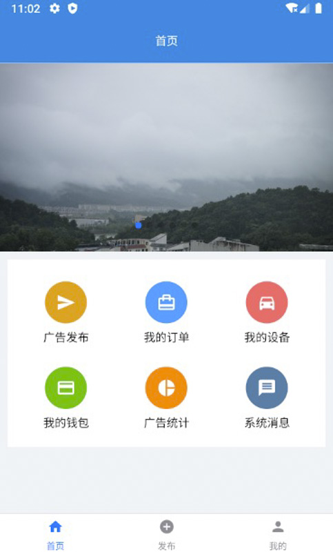
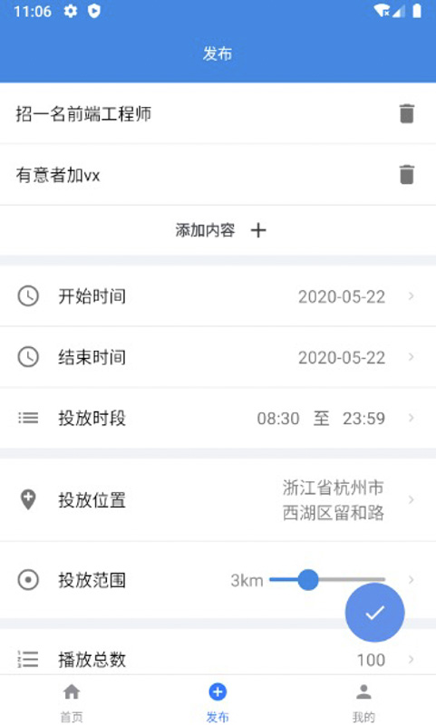
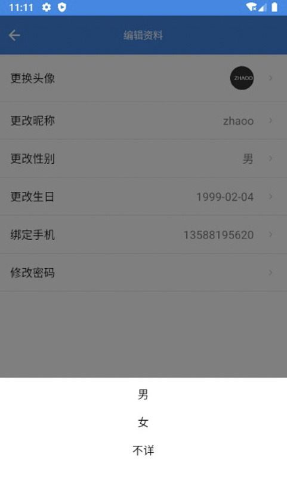

# adApp

共享车载屏汽车广告投放系统（客户端，基于 RN 开发）

[后端链接](https://github.com/wezhyn/ad-launch) (by wezhyn)

### 技术栈

- 框架：[React Native](https://reactnative.com/)
- 路由导航：[react-navigation](https://reactnavigation.org/)
- UI组件：[react-native-elements](https://react-native-elements.github.io/react-native-elements/)
- 网络请求：[axios](https://github.com/axios/axios)
- 状态管理：[redux](https://redux.js.org/)、[redux-thunk](https://github.com/reduxjs/redux-thunk)、[react-redux](https://github.com/reduxjs/react-redux)
- Icon图标：[react-native-vector-icons](https://github.com/oblador/react-native-vector-icons)
- 轮播图：[react-native-swiper](https://github.com/leecade/react-native-swiper)
- 支付宝：[react-native-alipay](https://github.com/0x5e/react-native-alipay)
- 百度地图：[react-native-baidu-map](https://github.com/lovebing/react-native-baidu-map)
- 弹出输入框：[react-native-dialog-input](https://github.com/joseestrella89/react-native-dialog-input)
- HTML渲染：[react-native-htmlview](https://github.com/jsdf/react-native-htmlview)
- 欢迎页：[react-native-app-intro-slider](https://github.com/Jacse/react-native-app-intro-slider)
- 日期时间选择：[datetimepicker](https://github.com/react-native-community/react-native-datetimepicker)
- Fab按钮：[react-native-action-button](https://github.com/mastermoo/react-native-action-button)
- 组件相对路径：[babel-plugin-root-import](https://github.com/entwicklerstube/babel-plugin-root-import)
- 时间格式化：[moment](https://momentjs.com/)

### 截图

  
  

  
  

  
  

  
  

  
  

